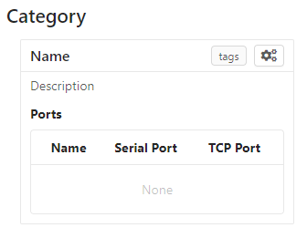
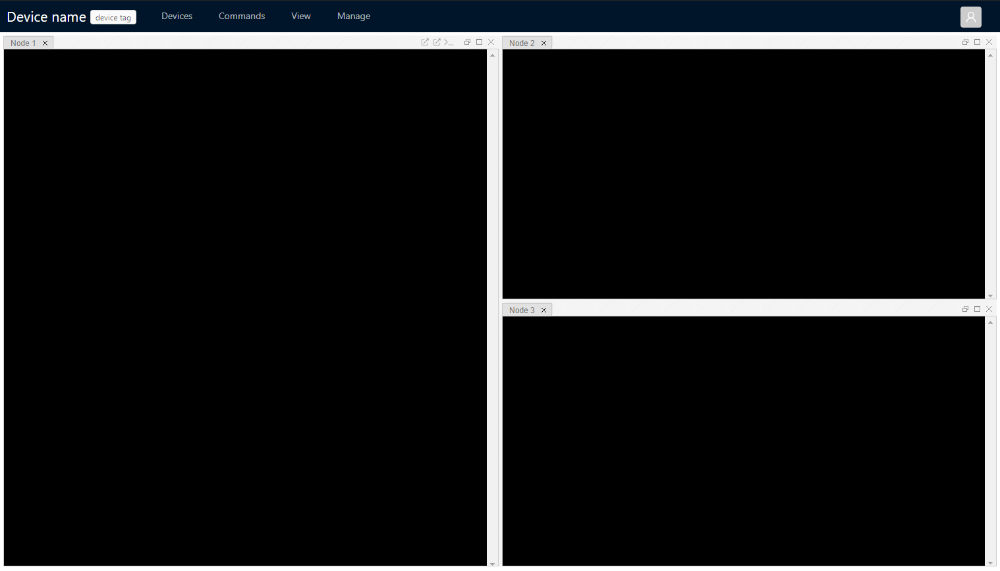
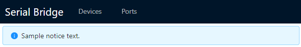
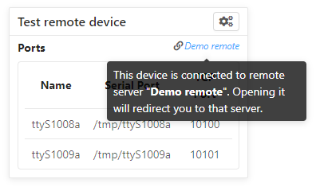
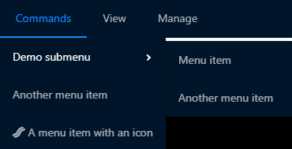
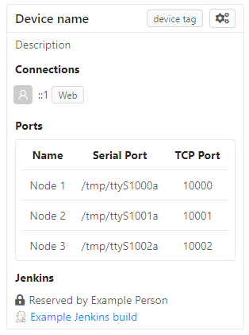

.. highlight:: javascript
.. role:: field-mandatory
.. role:: field-optional
.. role:: tag

Serial Bridge
=============

Serial Bridge is a utility for interacting with serial ports, primarily ports connected to UARTs on embedded devices.

While Serial Bridge offers many ancillary features, it ultimately aims to overcome two deficiencies of connecting directly to the serial port:

* **Remote access**, so the port can be read/written without needing to be connected to the same machine the device is plugged into.
* **Multiplexed access**, so multiple users can read/write the port at the same time.

.. TODO Screenshot(s)

.. _platform:

Platform
--------

There currently aren't any automated tests, so I can only speak to configurations I personally use:

* **Operating System**: Known to work on both Windows and Linux. macOS is likely also fine, but untested.
* **Node.js**: Known to work under Node 10. Builds fine under Node 12, but untested. Node 14+ doesn't currently work because of a build problem in a dependency. I'll likely fix this at some point, but it's not a high priority. If you need to run a separate copy of Node for this project, I recommend looking into `nvm <https://github.com/nvm-sh/nvm>`_.

.. _installation:

Installation
------------

* Download and install `Node.js <https://nodejs.org/>`_. This includes the ``npm`` tool you'll be running in a moment.
* Download the `latest release <https://github.com/mrozekma/serial-bridge/releases/latest>`_ from Github. If you want to build from source, ``yarn package`` will generate the same ``serial-bridge.zip`` release package.
* Unpack the release archive.
* Open a terminal in the unpacked ``serial-bridge`` directory.
* Run ``npm install`` to install dependencies.
* Run ``npm run start`` to start the server. You should get an error about a missing configuration file, which segues to the next section:

.. TODO Running as a service

.. _config:

Configuration
-------------

Serial Bridge's configuration is stored in the file ``config.js``. A sample configuration file is at ``config.example``, so you can make a copy of this file and fill it in. The sample configuration file is full of comments, but it's still a bit terse, so this section gets into all the gory details.

The only thing the configuration file is required to do is declare a ``config`` variable. This can either be an object, or a function that returns an object. That is::

   config = {
      example: true,
   };

or::

   function config() {
      return {
         example: true,
      };
   }

This function can be asynchronous, if necessary::

   async function config() {
      return {
         example: true,
         async_example: await otherFn(),
      };
   }

The following subsections break down the keys this ``config`` object can contain.

.. _config_devices:

:field-mandatory:`devices`
^^^^^^^^^^^^^^^^^^^^^^^^^^
Serial ports are grouped by device, on the theory that devices plugged into the host will have more than one port each. Each device appears as its own element in the web UI home page, as depicted below, and each device also has a dedicated webpage showing the output of all ports on that device.

   How a device is rendered on the web view homepage.

The ``devices`` key is the only mandatory configuration key. It is an array containing objects with the following keys:

.. TIP:: If you are adding a number of similar devices (e.g. they all have the same nodes and just vary in port assignments), it can be convenient to make a function that takes the differing information as arguments and returns the complete device object. Then your configuration can do:

   .. code-block::

      function makeDevice(deviceName, node1Path, ...) {
         return {
            name: deviceName,
            nodes: [
               {
                  name: 'Node 1',
                  comPort: node1Path,
                  ...
               },
               ...
            ],
         };
      }

      config = {
         devices: [
            makeDevice('Device 1', 'COM10', ...),
            makeDevice('Device 2', 'COM20', ...),
            makeDevice('Device 3', 'COM30', ...),
         ],
      };

:field-mandatory:`name`
"""""""""""""""""""""""
The name of the device. This is displayed to users in the web UI and also appears in the URL.

:field-optional:`description`
"""""""""""""""""""""""""""""
The description of the device. A few lines of this are shown on the web home; the rest can be shown by mousing over it.

:field-optional:`category`
""""""""""""""""""""""""""
The category this device is sorted into on the web home. If omitted, the device goes into the unnamed category at the top of the page.

:field-optional:`tags`
""""""""""""""""""""""
An array of either strings or objects, one per tag. Tags are shown on the right side of the device box on the home page, and next to the device name on the device page.

Each element of the array can either be a string for the tag name, or an object containing the following keys:

* :field-mandatory:`name` -- The tag name.
* :field-optional:`description` -- The tag description, shown in a tooltip on mouseover.
* :field-optional:`color` -- The tag color, either ``'#RRGGBB'`` or a `CSS-recognized color name <https://developer.mozilla.org/en-US/docs/Web/CSS/color_value>`_.
* :field-optional:`showOnDevicePage` -- ``false`` if this tag should only be shown on the home page, not on the device's page as well. Defaults to ``true``.

:field-optional:`metadata`
""""""""""""""""""""""""""
This is an object containing arbitrary extra data about a device. It is included in API requests that expose device information, but otherwise not used by Serial Bridge.

:field-mandatory:`nodes`
""""""""""""""""""""""""
An array of nodes, Serial Bridge parlance for ports. Each node bidirectionally connects one serial port to a TCP port, and appears in the web UI as a terminal window:

   A device's web view, with three nodes connected to serial ports.

Each object in the ``nodes`` array contains the following keys:

:field-mandatory:`name`
#######################
The name of the node. This is displayed to users in the web UI.

:field-mandatory:`comPort`
##########################
The serial port path. On Linux this is typically ``'/dev/pty<n>'``, while on Windows it's typically ``'COM<n>'``.

:field-mandatory:`tcpPort`
##########################
The TCP port to listen on for connections to this node.

:field-mandatory:`baudRate`
###########################
The port's bit speed as an integer. Any speed supported by the underlying operating system is allowed, but this must match the speed the connected device is using or you'll end up receiving malformed data.

:field-optional:`byteSize`
##########################
The number of data bits in each character. Can be ``5``, ``6``, ``7``, or ``8``. Defaults to ``8``, the most common value.

:field-optional:`parity`
########################
How to format the extra parity bit included with each character, if any. Can be ``'even'``, ``'odd'``, or ``'none'``. Defaults to ``'none'``, the most common value.

:field-optional:`stop`
######################
The number of stop bits sent after each character for resynchronization purposes. Can be ``1`` or ``2``. Defaults to ``1``, the most common value.

.. _webLinks:

:field-optional:`webLinks`
##########################
An array listing the buttons that should appear in the device web view. These buttons are located in the node's titlebar, on the right side (but to the left of the layout buttons):

   Web links and layout buttons.

The array can contain the following strings, each of which creates the described button:

* ``'telnet'`` -- Open the node's TCP port in the system's default telnet client.
* ``'raw'`` -- Open the node's TCP port in Putty's "raw" mode. This is Putty-specific and requires :ref:`extra setup <node-link-clients>`.
* ``'ssh'`` -- Connect to the node over SSH. This requires :ref:`extra setup <node-link-clients>`.

By default, no web links are shown.

:field-optional:`ssh`
#####################
The SSH connection to establish when the SSH web link button is pressed. This key is mandatory if ``'ssh'`` is included in the :ref:`webLinks array <webLinks>`.

This object contains the following keys:

* :field-mandatory:`host` -- The remote hostname or IP address.
* :field-optional:`username` -- The username to authenticate with.
* :field-optional:`password` -- The password to authenticate with.

:field-optional:`metadata`
##########################
This is an object containing arbitrary extra data about a node. It is included in API requests that expose node information, but otherwise not used by Serial Bridge.

.. _config_device_jenkinsLock:

:field-optional:`jenkinsLock`
""""""""""""""""""""""""""""""
If Jenkins is :ref:`integrated <jenkins>` with Serial Bridge, this is the name of the lockable resource in Jenkins that corresponds to this device. When the device is reserved by a person or locked by a build, it will be shown in the web interface.

:field-optional:`web`
^^^^^^^^^^^^^^^^^^^^^
Most of this documentation assumes you will be using the web interface, but it's actually optional. If this key is omitted, Serial Bridge won't do anything but bridge serial ports to TCP ports. If this key is included, the object contains the following keys:

* :field-optional:`port` -- HTTP port to listen on. Defaults to ``80``.
* :field-optional:`ssl` -- SSL configuration. Including this will let the specified port speak both HTTP and HTTPS. The object contains the following keys:

   * :field-mandatory:`cert` -- The SSL certificate.
   * :field-mandatory:`key` -- The associated SSL private key.
   * :field-optional:`passphrase` -- The encryption passphrase for the private key. If omitted, the key must be unencrypted.

.. _config_users:

:field-optional:`users`
^^^^^^^^^^^^^^^^^^^^^^^
The web view will show :ref:`users <users>` connected to a device, both via the web UI and directly to node TCP ports. By default users are just identified as their hostname, but this can be enhanced via this configuration object containing the following keys:

* :field-mandatory:`identify` -- A function that attempts to identify a user given their hostname. See the :ref:`users <users>` section for more details.
* :field-optional:`avatarSupport` -- A flag indicating if the identify function will also specify user avatars. This affects the help text the user is shown on the home page. Defaults to ``false``.

.. _config_remotes:

:field-optional:`remotes`
^^^^^^^^^^^^^^^^^^^^^^^^^
An array of objects defining :ref:`remote Serial Bridge instances <remotes>` to peer with. Each object contains the following keys:

* :field-mandatory:`name` -- The name of the remote. Shown on the home page in the corner of the device box.
* :field-mandatory:`url` -- The base URL of the remote, including the port if non-standard.
* :field-optional:`deviceRewriter` -- A function that takes an object describing the remote device and returns a modified copy of the device. This is intended to tweak the category and tags of the remote devices, but any fields can be changed.

.. _config_commands:

:field-optional:`commands`
^^^^^^^^^^^^^^^^^^^^^^^^^^
An array of objects defining :ref:`commands <commands>` that can be executed in the device web view. These commands are shown in a dropdown menu. Each object contains the following keys:

* :field-mandatory:`label` -- The label to display in the menu item.
* :field-optional:`icon` -- The icon to display next to the menu item label. Icons are pulled from `FontAwesome <https://fontawesome.com/icons?m=free>`_ and are specified by the icon's full class. For example, `this icon <https://fontawesome.com/icons/smile?style=solid>`_ is ``'fas fa-smile'``.
* :field-optional:`fn` -- The function to execute when the user clicks this command.
* :field-optional:`submenu` -- An array of commands/submenus to display beneath this menu item. The objects in this array contain the same keys listed here.

Every command object must contain exactly one of ``fn``, if the menu item is a command, or ``submenu``, if the menu item is a submenu.

:field-optional:`notice`
^^^^^^^^^^^^^^^^^^^^^^^^
A notice to show users at the top of the web home page.

.. _config_portsFind:

:field-optional:`portsFind`
^^^^^^^^^^^^^^^^^^^^^^^^^^^
Configuration for the :ref:`port-finding tool <ports_find>`. Contains the following keys:

* :field-optional:`enabled` -- A flag indicating if the port-finding tool should be enabled. Giving users access to every serial port on the system has security implications, so this is ``false`` by default.
* :field-optional:`patterns` -- Pre-defined pattern sets, used to automatically identify nodes based on their output. Each key in this object is the name of the predefined set, while the value is an array of objects containing the following keys:
   * :field-mandatory:`pattern` -- A string containing a regular expression to watch for.
   * :field-mandatory:`name` -- The name of the node this pattern identifies.

:field-optional:`savedState`
^^^^^^^^^^^^^^^^^^^^^^^^^^^^
How to handle the files stored on the server when a user shares their terminal state. Contains the following keys:

* :field-optional:`dir` -- Directory to store saved state files in. Defaults to ``./saved-state``. Will be interpreted relative to the root Serial Bridge directory.
* :field-optional:`expireAfter` -- Minutes to retain a saved state file before deleting it. Defaults to 43200 (30 days). Can be set to ``undefined`` to never delete saved states.
* :field-optional:`maxSize` -- Maximum number of bytes a single saved state file can be. Defaults to ``undefined`` (no limit).

:field-optional:`jenkinsUrl`
^^^^^^^^^^^^^^^^^^^^^^^^^^^^
If Jenkins is :ref:`integrated <jenkins>` with Serial Bridge, this is the root URL of the Jenkins installation.

:field-optional:`blacklist`
^^^^^^^^^^^^^^^^^^^^^^^^^^^
An array of hostnames and IP addresses to block from connecting to the web interface and node telnet ports. Serial Bridge will attempt to convert hostnames to IPs and the reverse on startup, but after that the blacklist is fixed. Best practice is to list exactly the string you see in the console output when the target host tries to connect.

.. _users:

Users
-----
The Serial Bridge web UI lists all the users connected to ports on a device, both on the home page and device page. For the latter case, users are pictured along the right side of the menu bar. Mousing over an avatar will show the user's name, hostname, and a list of open ports:

.. figure:: web-users.png

I should stress here that Serial Bridge has no concept of accounts or logins. User information comes from two sources:

* Provided by the user in the "You" section of the home page.
* Provided by the :ref:`users.identify <config_users>` configuration function.

The ``users.identify`` function is an optionally asynchronous function that takes an object describing the user. This object has the following keys:

* **host** -- The user's hostname.
* **displayName** -- The user's real name.
* **email** -- The user's e-mail address.
* **avatar** -- A URL for the user's avatar image.

This object will only have some keys going into the ``users.identify`` function:

.. csv-table::
   :header: Key, Incoming, Outgoing

   ``host``, Yes, No
   ``displayName``, Maybe, Yes
   ``email``, Maybe, Yes
   ``avatar``, No, Yes

Keys marked "incoming" will (or may) be set on the object when ``users.identify`` is called. Keys marked "outgoing" can be updated by ``users.identify``, although none are required. If unset, the user's display name becomes their hostname and their avatar is left generic. If ``displayName`` and ``email`` are set going into the function, it's because the user manually provided them, so the function should probably not modify them.

How to actually implement ``users.identify`` is left to you, based on the hostname conventions of your network. Sample code is provided in the example configuration file to extract a username from the hostname, look up the user's name and e-mail in Active Directory, and then use `Gravatar <http://www.gravatar.com/>`_ for the avatar.

.. _remotes:

Remotes
-------
Serial Bridge can only connect to serial ports on the machine it's running on. In other words, if you have devices plugged into multiple host machines, you will need to run Serial Bridge on each of them. However, you can list other Serial Bridge instances in the :ref:`remotes <config_remotes>` configuration key to display their devices on your home page. These device listings are live, but clicking one will redirect you to the remote web UI.

Remote devices are identified on the right edge of the device box:

There's also a per-user toggle on the top-right of the home page to disable showing remotes.

.. _commands:

Commands
--------
Commands are blocks of code from the configuration file that users can trigger on demand. Commands are accessed from the "Commands" menu on a device's web page:

Any real command menu item (i.e. a menu item that isn't just a submenu) must provide a :ref:`fn <config_commands>` function in the configuration file that is executed when the user clicks the menu item. This is an optionally asynchronous function taking one object containing functions to interact with the device. This object is typically named ``api``; for example:

.. code-block::

   config = {
      ...
      commands: [{
         label: "Send 'hi' to 'test' node",
         icon: 'fas fa-smile',
         async fn(api) {
            api.sendln('test', 'hi');
         },
      }],
      ...
   };

The ``api`` object contains the following functions:

.. code-block:: typescript

   getDevice()

..

   Returns an object containing information about the current device. This object is the same one returned by the :ref:`Devices API <api>`, so you can open that in a browser for more information.

.. code-block:: typescript

   send(nodeName: string, message: Buffer | string)

..

   Sends the specified data to the specified node.

.. code-block:: typescript

   sendln(nodeName: string, message: string)

..

   Send the specified data to the specified node, and append ``'\r\n'``.

.. code-block:: typescript

   recvAsync(nodeName: string, handler: (data: Buffer) => void, bufferLines: boolean = false)

..

   Pass incoming data from the specified node to the handler. If bufferLines is true, one complete line at a time is passed to the handler. Returns a function that can be called to stop receiving data.

.. code-block:: typescript

   drawTermLine(label: string, caps?: 'start' | 'end')

..

   Draw a colored line in every terminal to delineate an event. ``caps`` indicates how the end of the line should look:

   .. csv-table::
      :header: caps, Formatted line

      ``'start'``, ``┌─── Label ───┐``
      ``undefined``, ``──── Label ────``
      ``'end'``, ``└─── Label ───┘``

.. code-block:: typescript

   showModal(title: string, rows: { key: string; value: string | boolean }[])

..

   Show a modal dialog on the web interface. This interface is likely to change, but for the moment it displays a two-column table of information. For example, this call::

      api.showModal('Demo modal', [
         { key: 'Row 1', value: 'Value 1' },
         { key: 'Row 2', value: true },
      ]);

   will draw:

   .. figure:: web-device-command-modal.png

.. _jenkins:

Jenkins
-------
Serial Bridge has some half-baked integration with `Jenkins CI servers <https://www.jenkins.io/>`_. Someday I might write a Jenkins plugin, but at the moment this requires some work on your part.

.. _jenkins_build_state:

Build state
^^^^^^^^^^^
Serial Bridge can show the currently running build using the given device. It can also show a subdivision of the build, called a **stage**, and a subdivision of the stage, called a **task**. This information is shown on the home page and the device page's titlebar:

This information is sent to Serial Bridge via an HTTP PATCH request. The API URL is ``<serial bridge host>/api/jenkins/<lock name>``, where ``<lock name>`` is the :ref:`jenkinsLock <config_device_jenkinsLock>` value in the device's configuration object. The following data should be sent in the PATCH request:

+-------------+---------------------------------------------------------+
| Operation   | Data                                                    |
+=============+=========================================================+
| Start build | * **startBuild**: ``true``                              |
|             | * **name**: Build name                                  |
|             | * **link**: Build link                                  |
+-------------+---------------------------------------------------------+
| End build   | * **result**: ``true`` on success, ``false`` on failure |
+-------------+---------------------------------------------------------+
| Start stage | * **pushStage**: Stage name                             |
+-------------+---------------------------------------------------------+
| End stage   | * **popStage**: ``true``                                |
+-------------+---------------------------------------------------------+
| Start task  | * **pushTask**: Task name                               |
+-------------+---------------------------------------------------------+
| End task    | * **popTask**: ``true``                                 |
+-------------+---------------------------------------------------------+

Builds contain stages and stages contain tasks, so e.g. ending the current stage will also end the current task, if any.

This example cURL command starts a build on the device with lock name ``device1``:

.. code-block:: sh

   curl -X PATCH 'http://serial-bridge-host/api/jenkins/device1' --data 'startBuild=true&name=Build name&link=http://jenkins-host/job/Name/123'

Locking
^^^^^^^

If you use the Jenkins `Lockable Resources <https://plugins.jenkins.io/lockable-resources/>`_ plugin to indicate who is currently using a device, you can reflect this information in Serial Bridge. Locks are shown in the same place as Jenkins builds:

Serial Bridge needs to know every time a Jenkins lock changes. This begs to be solved with a plugin, but lacking that, I currently solve it with `incron <http://inotify.aiken.cz/?section=incron&page=about&lang=en>`_ and a Bash script. Incron is like cron, but events are triggered by filesystem events instead of time events. Every time Jenkins locks change, the file ``$JENKINS_HOME/org.jenkins.plugins.lockableresources.LockableResourcesManager.xml`` is updated. Incron can watch for this, and send the entire file to Serial Bridge, which will parse it and update its lock information.

Run ``incrontab -e`` to edit your incrontab file. Add an entry that triggers when a file is moved to the Jenkins home directory (Jenkins doesn't write directly to the target XML file, it writes a new file and then renames it):

.. code-block:: text

   /path/to/jenkins-home/   IN_MOVED_TO,recursive=false     /path/to/jenkins-home/file-moved.sh "$@" "$#"

Then implement the specified ``file-moved.sh`` script. Incron will call it with the target directory name and filename, so it needs to check that the file is the one containing lock information and then POST it to Serial Bridge:

.. code-block:: bash

   #!/bin/bash
   set -e
   dir=${1:?Missing directory}
   file=${2:?Missing filename}

   if [ "$file" = "org.jenkins.plugins.lockableresources.LockableResourcesManager.xml" ]; then
      curl -X POST -d @"$dir/$file" http://serial-bridge-host/api/lock
   fi

.. _node-link-clients:

Web link clients
----------------

Depending on the node's configuration, you will see some of these buttons in the node's titlebar on the device's web page:

The right three buttons control the page layout and are irrelevant here, but the left three are called "web links". They correspond to the following:

* **telnet** -- Open the node's TCP port in the system's default telnet client.
* **raw** -- Open the node's TCP port in PuTTY's "raw" mode.
* **ssh** -- Connect to the node over SSH.

Browsers support telnet links natively and so the telnet web link will work with whatever your default Telnet client is. The other two options require you to install a supported client to handle those links, and possibly do some extra configuration to make the links work. Instructions on how to do this are on the Serial Bridge home page in the "Setup" tab. Raw and SSH links will not be shown to users who haven't specified their preferred client on the "Setup" tab.

.. _ports_find:

Port-finding tool
-----------------

The port-finding tool is accessible from the home page main menu, at :menuselection:`Ports --> Find Ports`. It is disabled by default to avoid exposing every serial port on the system to your entire network; see the :ref:`portsFind <config_portsFind>` configuration key to enable it.

Once enabled, the tool acts like a wizard and steps you through identifying the new ports. This is most useful when you are plugging in a number of ports at once. At a high level, the steps are:

* Plug in the device and note which new ports appear.
* Turn on the device and watch the output on the new ports to identify them.
* Generate a :ref:`configuration entry <config_devices>`.

.. _api:

API
---

A REST-based API is located at ``<serial bridge host>/api``. It's not yet particularly well documented, but the most useful routes are:

* :tag:`GET` ``/api/devices`` -- Get an array of all devices
* :tag:`GET` ``/api/devices/<ID>`` -- Get information about a particular device
* :tag:`GET` ``/api/config/version`` -- Get information about the Serial Bridge instance
* :tag:`GET` ``/api/jenkins/<LOCK_NAME>`` -- Get information about a device's running Jenkins build. See the :ref:`Jenkins <jenkins_build_state>` section for more information about PATCHing this route.

.. TODO Ephemeral devices

.. TODO General usage guide
